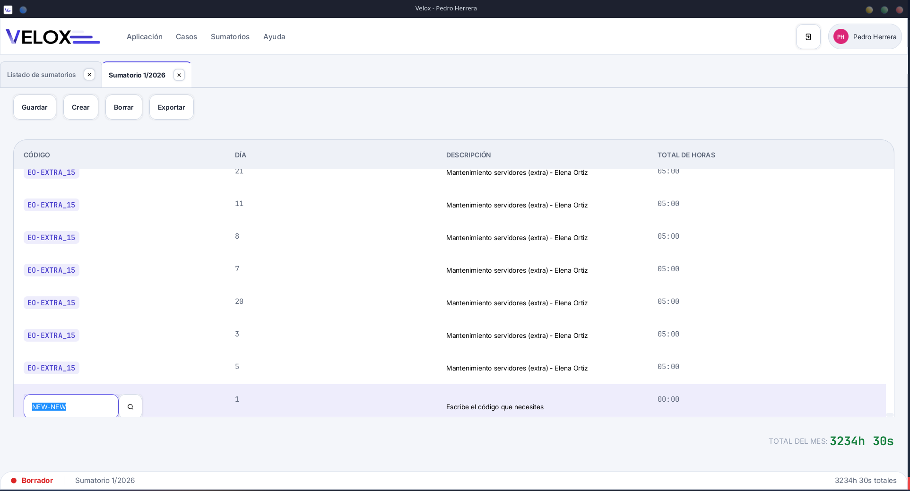

# Velox 🕐

Software de escritorio para la **contabilización de horas de trabajo** de empleadas. Ligero, específico y sin distracciones.



## ¿Por qué existe este proyecto?

Mis padres gestionaban las horas de sus trabajadoras con **Factucont**, un software de facturación que no está pensado para eso. La alternativa era Excel, pero acababa siendo una hoja gigantesca llena de copias y pegados que crecía sin control.

Evalué soluciones más completas como **Odoo** — de hecho sé crear módulos para él — pero no es lo buscan exactamente, quieren un software de escritorio tradicional que no requiera de navegador para funcionar.

Así nació Velox: rápido de usar, sin curva de aprendizaje, sin funcionalidades innecesarias. El nombre no es casual — el objetivo es que mi padre haga en segundos lo que antes le llevaba minutos.


## Funcionalidades (v1.0 MVP)
- **Multiempleado** - Trabajar con distintos empleados
- **Gestión de casos o clientes** — crear, modificar, listar y eliminar
- **Sumatorios de horas** — organizados mes a mes por trabajadora
- **Control de pendientes** — si un sumatorio del mes no ha sido creado, queda marcado como pendiente
- **Exportación** — impresión en papel o exportación a PDF para enviar a cada trabajadora


## Tecnologías

| Tecnología | Uso |
|---|---|
| Java 23 o superior | Lenguaje principal |
| JavaFX 25 | Interfaz gráfica de escritorio |
| SQLite + JDBC + ORMLite | Base de datos local embebida |
| Ikonli + [Unicon](https://kordamp.org/ikonli/cheat-sheet-unicons.html) | Iconografía |
| OpenPDF | Generación de PDFs |
| Maven | Gestión de dependencias y build |

---

## Arquitectura

La aplicación sigue el patrón **MVVM** (Model-View-ViewModel):

- **Vista** (FXML) — define la estructura visual, sin lógica
- **ViewModel** — coordina el estado de la UI y delega en los servicios
- **Servicio** — contiene la lógica de negocio
- **Repositorio** — acceso a la base de datos SQLite

La navegación principal se gestiona mediante un `TabPane` donde cada sección (trabajadoras, sumatorios) se abre como una pestaña. Los formularios de creación y edición se presentan como `Dialog` modales. La base de datos es un único archivo `.db` local, lo que simplifica las copias de seguridad.


## Requisitos

- Java 23 o superior
- Sistema operativo: Windows o Linux


## Instalación

### Para desarrolladores

```bash
git clone https://github.com/anescdev/velox.git
cd velox
mvn javafx:run
```

#### Configuración previa
Para que la app funcione deberás de definir un directorio de trabajo para esta mediante el argumento de línea de comandos --app-dir. Esto está dentro del [fichero pom](./pom.xml), en el plugin de **javafx-maven-plugin**, específicamente `<executions>` -> `<execution>` -> `<configuration>` -> `commandlineArgs`.

O tambien, y mas sencillo, crear una carpeta `.tmp` en la raíz del proyecto, y será donde se guardarán los datos
#### Debug
Debido a que se usa Vscodium para el desarrollo, el debugger configurado es del propio editor de código. 
Está configurado para que al abrir el proyecto puedas depurar con <kbd>F5</kbd> pero si estás usando un IDE 
u otro editor con soporte Java, tendrás que buscar la manera para que puedas conectar el depurador de ese IDE remotamente al
programa. Los pasos que deberás de seguir son:
1. Ejecutas el programa con `mvn javafx:run@debug`, creando una instancia de java a la espera de que el debugger se conecte al puerto **8282**.
2. Creas la configuración en tu IDE o editor para que este se conecte a la app de Java y puedas empezar a depurar.

### Para usuarios finales

Descarga el instalador correspondiente a tu sistema operativo desde la sección [Releases](https://github.com/anescdev/velox/releases) y ejecútalo. No necesitas instalar Java ni ninguna dependencia adicional.

> Los instaladores nativos se generarán a partir de la versión 1.0.


## Roadmap

- [x] Funcionalidades básicas
- [ ] Copias de seguridad automáticas configurables
- [ ] Idioma inglés


## Autor

Desarrollado por [AnesCDev](https://github.com/anescdev)


## Licencia


Este proyecto está licenciado bajo la **GNU General Public License v3.0** — consulta el archivo [LICENSE](LICENSE) para más detalles.
 
En resumen: puedes usar, modificar y distribuir este software libremente, pero cualquier trabajo derivado debe mantener la misma licencia y ser también open source.
